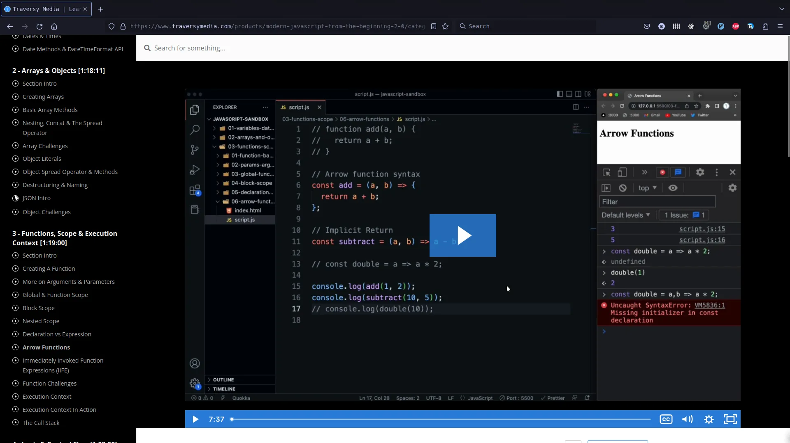
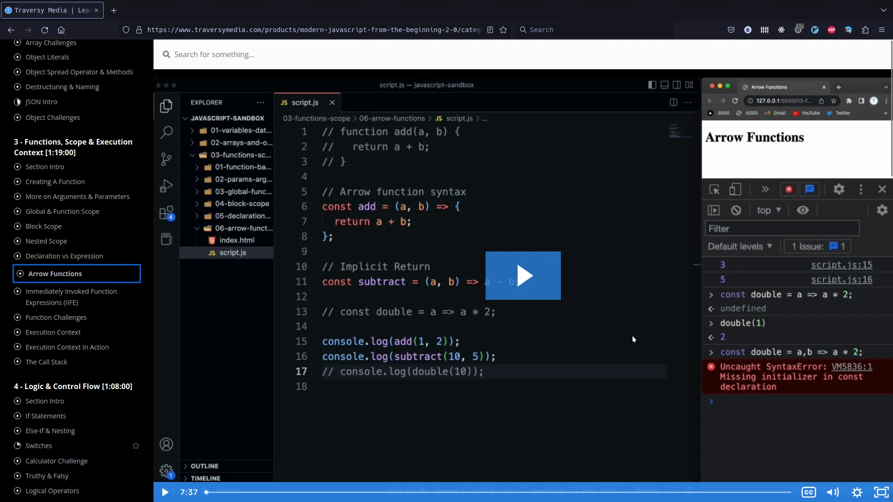

# Browser extension add on for students of Brad Traversy

This add on once enabled scrolls the current active lesson link into view on the
side menu of the course platform for [Traversy Media](https://www.traversymedia.com/).
It highlights it and places it in the center of the screen so you can easily
keep track of what lesson you are on, which is next and which is previous.

Additionally the extension now maximises the video to fit the available space in
the viewport i.e. no black borders around the video on large monitors.

The extension may work for other courses using the [Kajabi](https://kajabi.com/)
platform but I have not tested.

## Example view before extension:

## Example view after extension:

Extension for FireFox is in the main branch.

Extension for Chrome is in the chrome branch.

[Get the extension for FireFox](https://addons.mozilla.org/en-US/firefox/addon/traversy-scroll-active-lesson/)

[Get the extension for Chrome/Chromium](https://chrome.google.com/webstore/detail/traversy-media-scroll-act/nmddkphngjlkifpobgpcbfbmfmfpimam)
